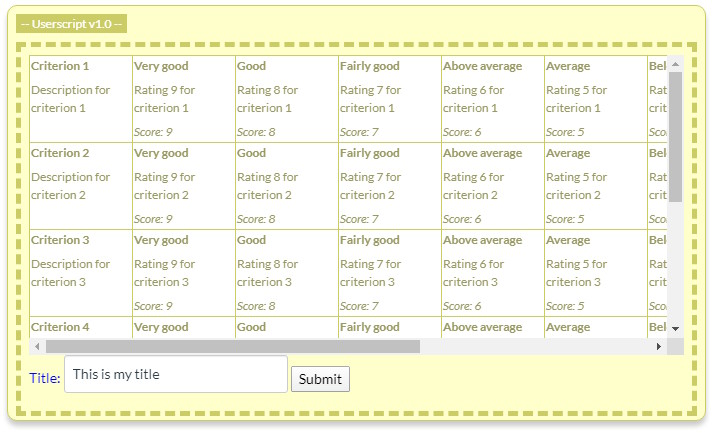

# LJMU School of Education: Canvas Hacks - Assignments

This project contains various enhancement to the Canvas VLE / LMS, relating to setting up assignments and rubrics. This document describes a process allowing Canvas users to avoid its in-built rubric design tool by designing their rubrics using spreadsheet software such as Microsoft Excel. 

Enhancement included in this Userscript:
* When creating an assignment, a tool is included to simplify adding appropriate file extensions when using "Restrict upload file types".
* In the *Rubric manager*, a tool is included to allow rubrics to be creating using spreadsheets.

## Installation
1. Install [TamperMonkey](http://tamperMonkey.net/) for your browser (tested with Chrome.)
2. Add the [main.user.js](https://raw.githubusercontent.com/LJMUSoE/CanvasHacks/master/Assignments/main.user.js) script to TamperMonkey.

## Introduction

TamperMonkey is a popular Google Chrome browser extension that lets users augment existing web pages to (unofficially) change or add features. These augmentations are known as Userscripts – lightweight chunks of software that the user can add to TamperMonkey, designed to trigger when the browser visits specific web pages. Once triggered, a Userscript has broad access to add its own functionality into the page. 

LJMU SoE has developed a TamperMonkey Userscript to add a second route for creating rubrics, alongside Canvas’ official rubric builder. This alternative route is more forgiving about the structure of the rubric, specifically the order the ratings are defined. 

> This Userscript is an unofficial add-on to Canvas’ it is not endorsed by Canvas. If it works for you, great, but don’t phone Canvas Support if it fails. 

## Creating a spreadsheet for the SoE TamperMonkey Userscript Canvas uploader 

The first row of each spreadsheet is the header row. It signifies the meaning of the values in each column beneath by using certain key terms. The columns can be in any order, so long as the first row (the header row) correctly identifies their contents. Further to this, certain columns are grouped together using an identifier appended to the end of their header key term. This will be easier to understand once you see examples. 

The values in the rows beneath the header describe the criteria of the rubric, one row per criterion. 

The header key terms are as follows: 
* **Criterion title** -- (required) signifies the column holds the titles of each criterion. 
* **Criterion description** -- (optional) signifies the column holds the long description of each criterion. 
* **Rating title {id}** -- (required) signifies the column holds the title for a specific rating, for each criterion. 
* **Rating description {id}** -- (optional) signifies the column holds the long description for a specific rating, for each criterion. 
* **Rating score {id}** -- (required) signifies the column holds the score for a specific rating, for each criterion. 

Some columns are optional, while others are required and will cause an error if missing. 

As explained, the columns can be in any order (the **Criterion title** does not have to be first, for example), but there can be only one **Criterion title** and **Criterion description** column. There can, however, be multiple **Rating title**, **Rating description** and **Rating score** columns – this is because each criterion can have multiple ratings, each made up of a title, long description (optional) and score. 

To group columns together into a single rating, an id is appended to the column’s header term. Thus, **Rating title 1**, **Rating description 1** and **Rating score 1** all belong together to form one rating, while **Rating title 2**, **Rating description 2** and **Rating score 2** all form a different rating. You can have as many ratings as you want, each formed by grouping multiple columns using the same id appended to the header. The ids do not have to be numeric; **Rating title MERIT**, **Rating description MERIT** and **Rating score MERIT** are all acceptable, likewise **Rating title Failed**, **Rating description Failed** and **Rating score Failed**, but the identifier must be identical on all grouped columns. 

Capitalisation is ignored (so **MERIT** and **merit** are treated as the same identifier), and some tolerance is allowed for the number of spaces between the words, but avoid using punctuation inside these identifiers. An identifier such as **Rating title: pass** (with a colon) will fail. 

But what if you need to create a rubric with a different number of ratings for some criteria?  

This can be done by simply leaving a single empty row in the spreadsheet, then using the next row as a fresh header. This allows you to create a totally new column structure, independent of any previous rows. This new structure can have a different number of ratings; it can even add or omit optional columns, present or absent in previous criteria rows. 

## Uploading your spreadsheet 

First you need to export your spreadsheet in a tab delimited format. From Excel click on "*Save as...*" and change the output file format to "*Text (tab delimited) \*.txt*" . Save **a copy** of the file in that format. 

Next, in Canvas, from "*Outcomes*" page click on the "*Manage rubrics*" button. If the TamperMonkey Userscript is active in your web browser you should see an upload box, like the one below. From your computer, drag and drop the tab delimited file into the dashed box. This will cause the Userscript to immediately upload the file and analyse it. 

If the file is in the correct format, you’ll see a preview of the rubric in a small window with scrollbars.

Check that the rubric is correct, enter a title for the rubric, then click Submit to upload it. If all goes well the page should reload and you should be able to see your new rubric, available to use or edit in Canvas. 

## Error messages, and what they mean 

The uploader may give the following errors: 

* **Upload was aborted** -– the upload of the tab delimited file was aborted by the user before it completed. 
* **Upload resulted in an error** -- the upload of the tab delimited file failed for some reason. 
* **Missing criterion title, row {n}** -- a required **Criterion title** value is missing, possibly because a row has an empty cell, or the column header is misnamed. 
* **Missing rating title, row {n}** -- a required **Rating title** value is missing, possibly because a row has an empty cell, or the column header is misnamed, or the appended column id doesn’t match with other columns in its intended group. 
* **Missing rating score, row {n}** -- a required **Rating score** value is missing, possibly because a row has an empty cell, or the value is not an integer number, or the column header is misnamed, or the appended column id doesn’t match with other columns in its intended group. 
* **Invalid course id: {id}** -- the script couldn’t identify the current course id. 
* **Cannot find authenticity token in cookies** – the script couldn’t extract the cookie Canvas uses to identify the current logged-in user from the page’s available cookies. 
* **Failed. Canvas rejected the rubric for some reason** – Canvas rejected the rubric when the Userscript tried to submit it to Canvas. This Userscript is an unofficial add-on to Canvas, and it is possible that updates to the rubric system may invalidate the way it works. 

> Note, if you fail to use a consistent group identifier across ratings header columns, the script will think it has two groups: one defining a title but missing a score, and the other defining a score but missing a title. An error message reporting **Missing rating title**, therefore, might actually be cause by an erroneous score header. 
